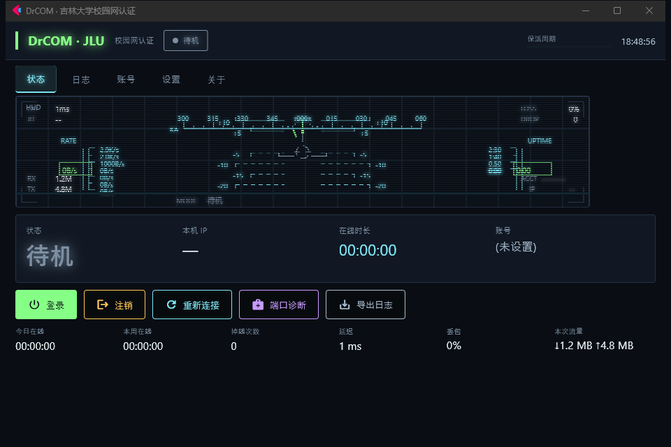
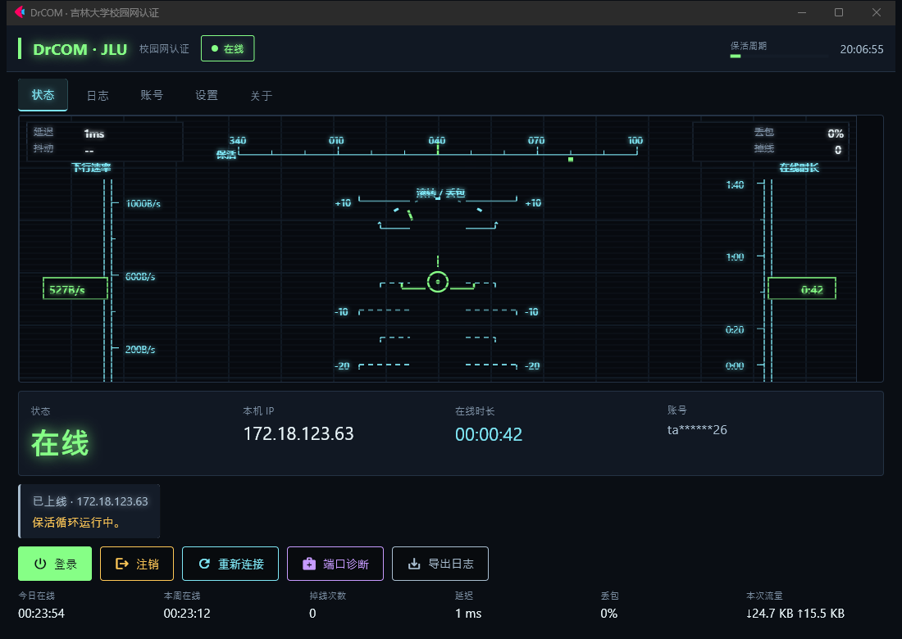

# JLU DrCOM NG

吉林大学校园网认证客户端，用 Python 重写，界面是基于 Flet 的 **HUD（平视显示器）风格**面板。

干的活和原版 Qt 客户端一样 —— 挑战、登录、保活 —— 但界面看得清、失败说得出原因、
端口被占了自己会想办法。

> English documentation: [README.md](README.md)

| 离线 | 在线 |
|---|---|
|  |  |

---

## 它做什么

**完成认证** —— 完整的 Dr.COM 流程（挑战 → 登录 → keepalive1 → keepalive2，
每 20 秒一轮），掉线自动重连，用指数退避而不是疯狂重试刷爆服务器。

**把失败原因说清楚** —— 每个登录错误码都映射成人话加一句「下一步怎么办」。
显示「密码错误」而不是「错误码 0x03」；显示「MAC 未绑定，可能需要先去自助服务解绑」
而不是「错误码 0x0B」。

**解决端口被占** —— 客户端必须绑 UDP 61440，这个端口经常被占。一句
`bind failed. Error code: 10013` 几乎没用，因为在 Windows 上 **10013 有两种完全不同的
成因**，光看错误码分不出来：要么是落在系统保留区间里（TUN/VPN 类软件会圈占），
要么是别的程序以独占方式绑着它。所以本程序不猜，而是**实测**：扫描邻近端口找出被阻断的
区间、查出是哪个进程占着，再给出和实际成因对得上的处置建议。

**网络环境变了也能自己缓过来** —— 无线和有线同时在线时，绑 `0.0.0.0` 是能成功的，
但内核按路由 metric 选路，报文可能从错的网卡出去，服务器就永远不回话。
本程序会依次改用本机每个具体地址重试，直到摸对。

**密码绝不明文落盘** —— Windows DPAPI，绑定当前 Windows 账号。

### 还有这些

- **系统托盘**与关闭不退出（依赖 `pystray`；没有它时「关闭」是**最小化**而不是隐藏，
  保证窗口绝不会找不回来）
- **守护进程**（`--watchdog`）：在客户端之外再起一层监督，进程崩溃就自动拉起，并
  顺手清掉崩溃留下的孤儿窗口。客户端主动退出时会留标记，守护进程看到就一起结束，
  所以「退出」不会变成关不掉的拉锯战。开关：`--cli watchdog on|off|status`
- **日志面板**：逐字节协议转储、一键导出、账号自动脱敏
- **统计**：今日 / 本周 / 累计在线时长、掉线次数
- **网络质量探测**：延迟、丢包、抖动。目标是真实网站（默认 `www.baidu.com`、
  `www.bing.com`），用**真实 HTTP 请求**计时而不是 ping —— 开着 TUN 模式的代理时
  ICMP 不出网、TCP 连接又被代理在本地应答，只有真跑一趟请求才量得到东西。
  抖动按 RFC 3550 在同一轮的连续往返之间计算，探测目标可在「设置」里改
- **多账号**管理、开机自启、启动自动登录
- **无界面 CLI** 与**本地 HTTP 状态接口**，方便脚本和桌面小部件调用
- **流量统计**、深色 HUD 主题、高对比度模式、减少动态效果

---

## 使用指导

### 1. 安装

```bash
pip install -r requirements.txt
```

主要面向 Windows，Python 3.10 及以上。

### 2. 先离线自检

```bash
python main.py --selftest     # MD4 向量、各长度报文、加密后端
python main.py --doctor       # 61440 能不能绑？不能的话，为什么？
```

两条都不联网、无副作用。`--doctor` 如果发现端口有问题，会直接打印真实成因和处置办法。

### 3. 填账号

```bash
python main.py
```

在**账号**页：

1. 填学号
2. 点「自动识别 MAC」（或手填 `AA:BB:CC:DD:EE:FF`）
3. 填密码
4. 保存

密码保存时立即加密，不会以明文形式写到磁盘上。

### 4. 联网

回到**状态**页点「登录」。HUD 上会显示当前状态、分配到的 IP、已经在线多久。
「注销」用于停止会话。

---

## 命令行

```bash
python main.py                          # 图形界面
python main.py --minimized              # 最小化启动（配合开机自启）
python main.py --cli login              # 前台认证并保持在线
python main.py --cli status --json      # 查询状态（退出码 0=在线 1=离线）
python main.py --cli diag               # 61440 被谁占了？
python main.py --cli probe              # 延迟 / 丢包
python main.py --cli export-logs        # 导出日志
python main.py --cli set --account 2023xxxxxxxx --mac AA:BB:CC:DD:EE:FF --password '***'
```

### 本地状态接口

默认关闭，在「设置 → 本地状态接口」里打开。

```
GET  /status   /health   /metrics   /stats   /logs   /diag
POST /login    /logout   /reconnect /probe        （需要令牌）
```

读接口开放；四个控制接口要求在 `X-DrCOM-Token` 头里带上令牌。
令牌每次启动随机生成，写在数据目录的 `api-token.txt`，「关于」页也会显示：

```bash
TOKEN=$(cat "$APPDATA/JLU-DrCOM-NG/api-token.txt")
curl -X POST -H "X-DrCOM-Token: $TOKEN" http://127.0.0.1:8848/reconnect
```

为什么不能只靠「仅本机」：**即使是浏览器里的网页发起的请求，来源地址也是 127.0.0.1**，
只校验地址的话，你访问的任何网站都能 POST 这个接口（CSRF）。
要求自定义头会强制浏览器先发 CORS 预检，而服务器从不放行预检，请求就发不出来。
同时校验 `Origin` 与 `Host`，DNS rebinding 也一并挡住。

默认只监听 `127.0.0.1`。`/metrics` 是 Prometheus 文本格式，可以直接接进监控面板；
同时会写一份 JSON 状态文件。

---

## 打包成自带依赖的程序

```bash
pip install pyinstaller
python build.py                 # 目录版，依赖全部自带
python build.py --onefile       # 单文件 exe
```

默认产物在 `dist/`，**完全自带**：目标机器不用装 Python、不用联网也能跑，
因为 Flet 的桌面运行时已经一起打进去了。如果本机还没有那个运行时，
先执行 `python build.py --fetch-runtime` 下载一次。

---

## 实现说明

协议是对原版客户端所用协议的重写，报文布局与**一次真实成功登录的抓包逐字节比对过** ——
整整 373 字节，`MD5A`、`MD5B`、`checksum1`、`checksum2` 和 MAC 异或值全部对得上。

有两处细节值得单独说明，因为网上流传的这份协议笔记是错的：

- `MD5B` 的输入是 `0x01 + 密码 + seed + 4 个 0x00`，不是 `0x01 + 密码 + seed`。
- `checksum2` 里 MAC 写在 `counter+8`，前面还有 6 字节临时字段。

更多细节写在各模块的 docstring 里；`tools/verify_against_log.py` 可以拿你自己的抓包
重跑一遍逐字节比对。

### 已知限制

- 「注销」不是真正的注销报文 —— 这个 Dr.COM 变体没有客户端注销包。
  它做的是停止保活并关闭套接字，服务端超时后释放会话。界面上是这么写的，不装。
- 托盘依赖 `pystray`。Flet 没有托盘控件，所以没有它时程序是最小化而不是隐藏。
- 界面只有深色主题（HUD 风格需要暗底），另提供高对比度模式。
- 主要在 Windows 上开发测试；套接字层有 POSIX 分支但跑得少。

---

## 致谢

没有 **[drcom-jlu-qt](https://github.com/code4lala/drcom-jlu-qt)**（作者
[code4lala](https://github.com/code4lala)）就不会有这个项目 —— 那个 Qt/C++ 客户端
一直在给吉大校园网做认证。它就是本项目的协议参考：这里每一个字段偏移，
都是读它的源码、再和它产生的抓包做 diff 得出的。

也感谢 [drcom-generic](https://github.com/drcoms/drcom-generic) 和
[mchome/dogcom](https://github.com/mchome/dogcom)：它们对 Dr.COM 其它变体的整理，
让吉大这一版的特殊性容易辨认了很多。

### 贡献者

- **[@hZsFN](https://github.com/hZsFN)** —— 项目发起与需求定义、真机联调与验收
- **[@Dafeiyu111](https://github.com/Dafeiyu111)**（大肥鱼）&lt;tanpan9926@mails.jlu.edu.cn&gt; —— Python / Flet 实现
- **code4lala** —— 原版 Qt 客户端与协议参考

---

## 许可证

GPL-3.0，与所参考的项目保持一致。见 [LICENSE](LICENSE)。
